# InvoNext (Smart E-commerce management)

- **Over All View**
  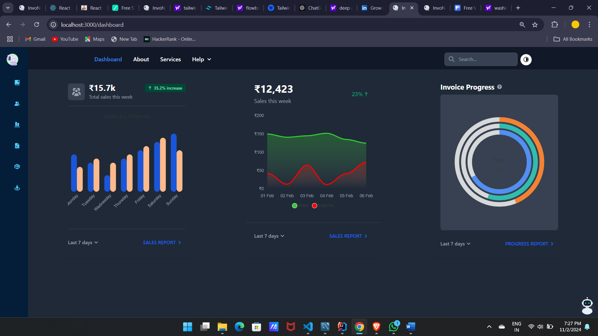
  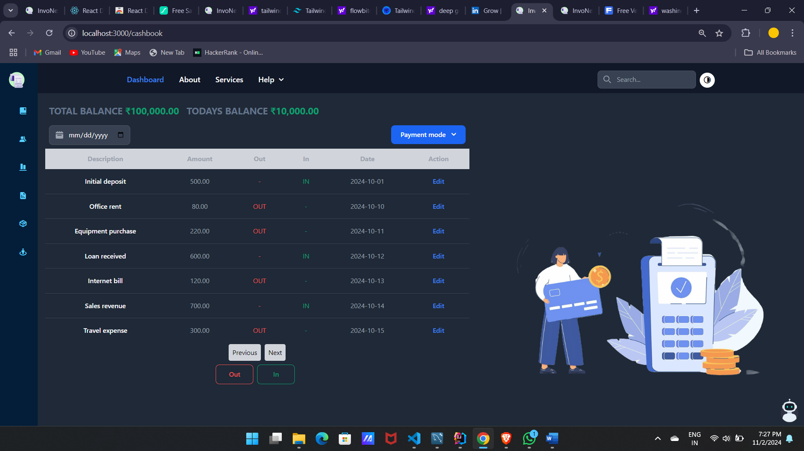

Manage Invoices for both online and offline purchases
## Table of Contents
- [Client Site](#client-site)
- [Admin Site](#admin-site)
- [Screenshots](#screenshots)

---

## Client Site

This section covers the client-facing part of the application. Here, users can view products, manage their shopping cart, and proceed with purchases.

### Client Site Screenshots

  

- **Shop Cart Home**
- **Shop Cart Login**
  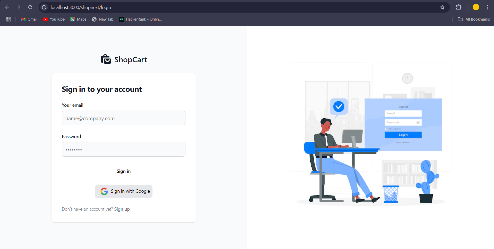
  - The login page for users to access their accounts and begin shopping.
  - 
 
  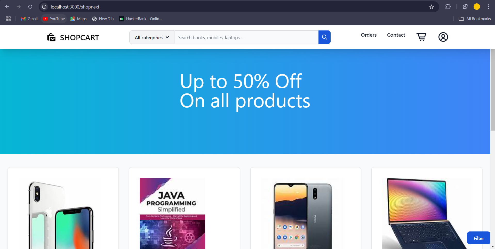
  - The main shop page where clients can browse through different products.

- **Shopping Cart**
  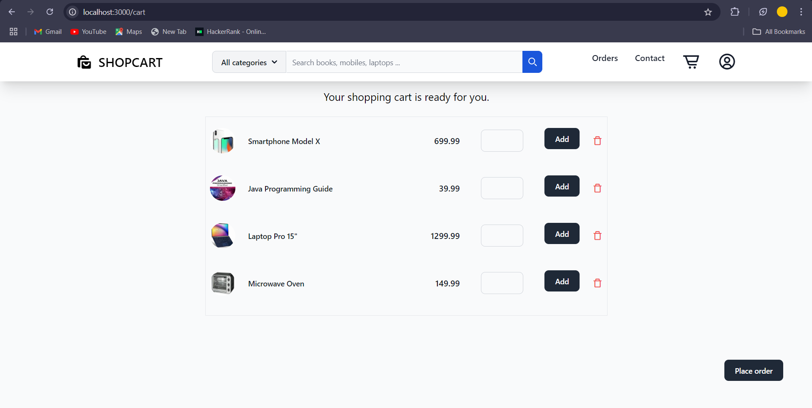
  - This shows the current items in the user’s cart, allowing them to adjust quantities, remove items, or proceed to checkout.

---

## Admin Site

This section is designed for administrators to manage the backend, including customer management, inventory, orders, and expenses.

### Admin Site Screenshots

- **Dashboard**
  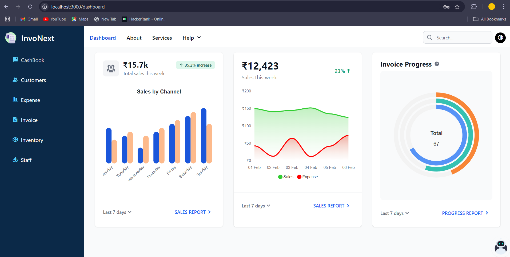
  - An overview of key metrics, including sales, expenses, and inventory status.
 
- **Cashbook Entry**
  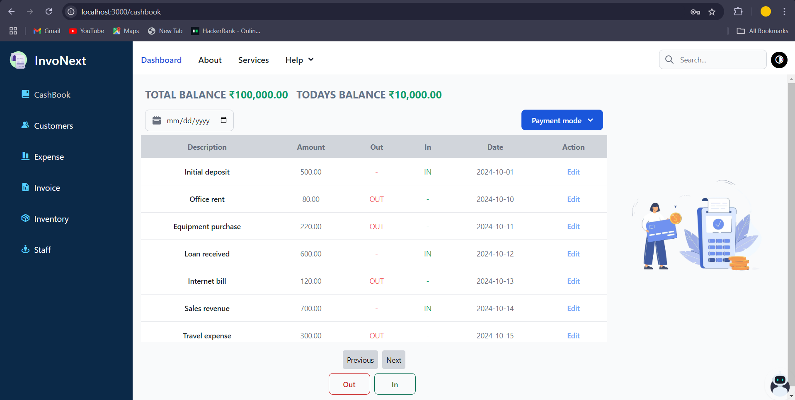
  - A page to add new cash transactions.
 
- **Add Customer**
  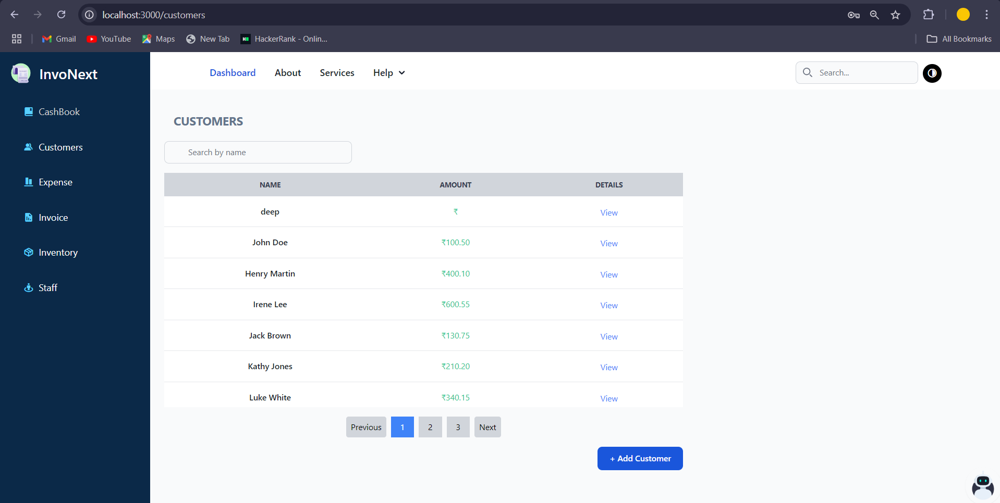
  - Allows admins to register new customers into the system.
 
- **Add Expense**
  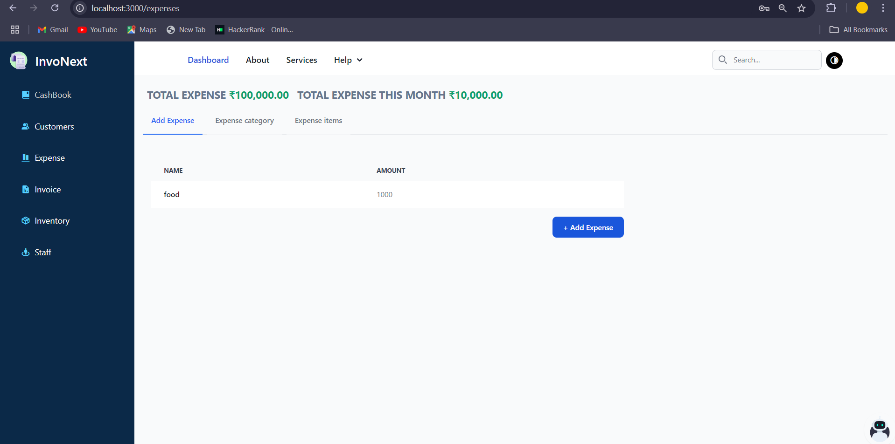
  - Enables admins to log new expenses for better financial tracking.

- **Add Product**
  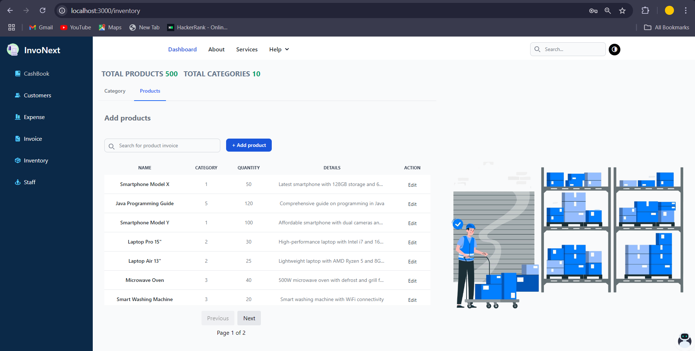
  - A form for admins to add new products to the inventory, with details such as name, price, and category.

- **Invoice Page**
  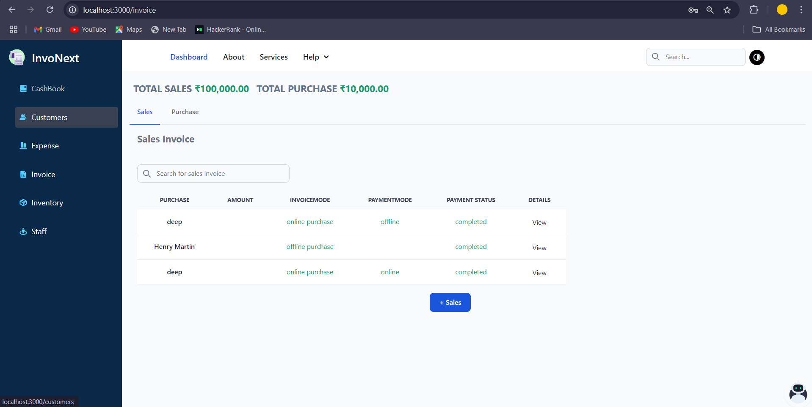
  - A list of generated invoices, showing all past transactions.

- **Invoice Generation**
  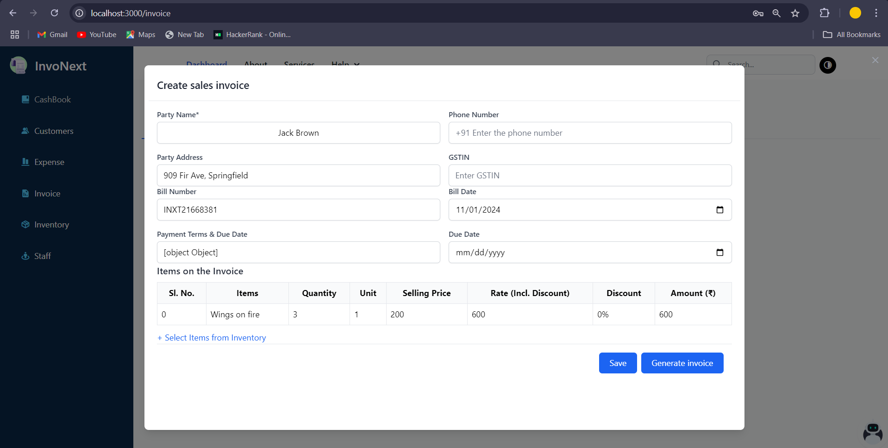
  - Interface to create invoices for client purchases.

## Features

- **Client Site**: Product browsing, shopping cart, user login.
- **Admin Site**: Inventory and order management, financial tracking, customer management, and report generation.

## Technologies Used

- **Frontend**: React
- **Backend**: SpringBoot

## Installation and Setup

---

## Screenshots

All the images above are organized in the `screenshots/` folder of the repository. If you want to explore each section in more detail, browse through this folder for additional images.
